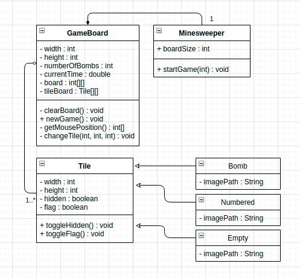

# 3296-Minesweeper
## Project Abstract
This is my take on the Minesweeper game developed in Java for 3296 Software Design class at Temple University. The game will use the practices of TDD and Object-Oriented programming in order to create an easy to use GUI that the user will use to interact with the game.
Below is a rough UML diagram that shows a basic plan on how the program will be created.

## Project Relevance
This project will be linked to Object Oriented Design, Test Driven Development, On-the-fly Coding, and Graphic User Interface. I, through the use of GitHub, will utilize some form of project management, version control, and potentially issue tracking in order to complete the project. The big object oriented design practices that will be visible within the project will be the tile objects. In order to create a more efficient piece of software, the tile attributes will be split up into two seperate classes. On-the-fly coding will be used in order to make testing the game's mechanics quicker. A graphic user interface will be used to give the user a more enjoyable experience while playing the game as well as allow me to hide more background processes from the user.

## Conceptual Design
The game will take up relatively square window, whose size will be determined by the user before starting a game. The user will be able to play the game using their mouse/trackpad. The game will feature a timer which will allow the user to determine how fast they are playing. The game will use a multi-dimensional array to hold board information and then, using the Swing class, display that information to the user using colorful images.

## Background
While I do not plan on taking source code from another project in order to create my game, I will be referencing the following URL's for tips/advice:
* https://zetcode.com/javagames/minesweeper/
* https://medium.com/@ArmstrongCS/making-minesweeper-in-10-minutes-e4c4e810fa06
* https://stackoverflow.com/questions/31226392/making-a-simple-mine-sweeper-game-in-java

## Required Resources
* As of right now, 100% of the project will be created by Michael D'Arcy
* Either Java or Python depending on which language is used to create the program
